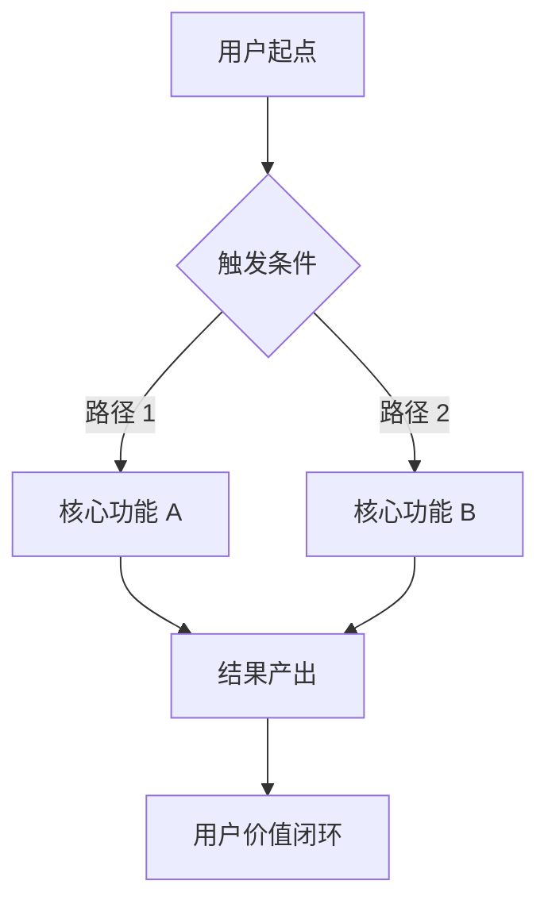
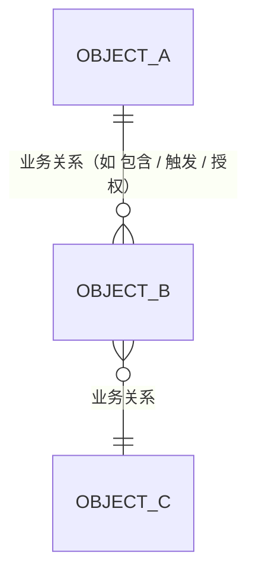
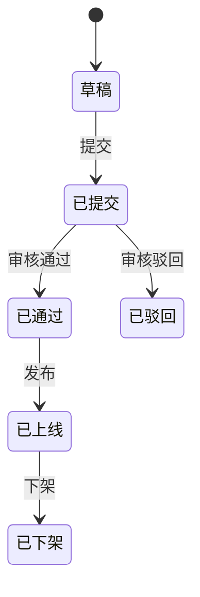

# {产品名} V{X.Y} 需求

## 一、Summary 版本说明

> 用 3-5 条要点说明本版本的核心变化，运营/开发/QA 看完这一段就能 get 重点。

1. {核心变化 1}
2. {核心变化 2}
3. {核心变化 3}

---

## 二、Problem & Goals 问题与目标

### 2.1 业务背景

> 1-2 段。为什么要做这件事？现状是什么？业务上发生了什么？

### 2.2 用户角色

| 角色 | 描述 | 主要诉求 | 权限范围 |
|---|---|---|---|
| {主要用户 A} | {一句话身份} | {1-2 条诉求} | {可做什么 / 不可做什么} |
| {主要用户 B} | {...} | {...} | {...} |

### 2.3 业务目标（北极星指标 + KR）

**北极星指标**：{核心增长/价值指标 · 可量化 · 单一指标}

**KR**（每条必须有基线 + 目标值）：
- KR1：{metric A} 从 {当前值}（基线：{来源}）提升到 {目标值}
- KR2：{metric B} 从 {当前值} 达到 {目标值}
- KR3：{metric C} 从 {当前值} 降到 {目标值}

### 2.4 非目标（No-gos · 本期明确不做）

> 借鉴 Shape Up「No-gos」：写下来防止 scope creep。

- ❌ {例：不做 {X 场景} · 留待 V{X.Y+N}}
- ❌ {例：不做 {Y 能力} · 由 {外部依赖} 提供}
- ❌ {例：不做 {Z 优化} · ROI 不足}

### 2.5 端到端流程图（必填 · 串起用户旅程）

### 2.6 Open Questions（待评审决议 · 可选）

> 借鉴 Google Design Doc：尚未决议的问题列在此处，评审会上拍板。决议后挪到 §7.2 ADR。

- ❓ {例：模型选 A 还是 B？决策日 {日期} · 决策人 {人}}

---

## 三、Scope 需求范围

### 3.1 需求清单（按优先级排序）

> 按 P0/P1/P2 排，**不按系统排**。详细设计见 §4。

| 序号 | 系统 | 功能 | 类型 | 优先级 | 需求摘要 |
|---|---|---|---|---|---|
| 1 | {端 A} | {模块 A}-{子功能 1} | 新增 | P0 | {一句话} |
| 2 | {端 A} | {模块 A}-{子功能 2} | 新增 | P0 | {一句话} |
| 3 | {端 B} | {模块 B}-{子功能 1} | 修改 | P1 | {一句话} |
| 4 | {端 B} | {模块 B}-{子功能 2} | 修改 | P2 | {一句话} |

> **类型**：新增 / 修改 / 废弃 · **优先级**：P0=必须本期 / P1=争取 / P2=可延后

### 3.2 非功能性需求（精简版）

| 维度 | 要求 |
|---|---|
| 性能 | AI 响应 P99 ≤ {阈值} · 页面加载 P99 ≤ {阈值} · 并发 {QPS} |
| 可用性 | SLA {99.9%} · LLM 失败降级 · 备份策略 {...} |
| 兼容 | Chrome ≥ 100 / Edge ≥ 100 / Safari ≥ 15 · 移动端 {...} |
| 数据安全 | PII 自动脱敏 · 操作审计 · 项目隔离 · 保留期 {...} |
| AI 合规（涉及生成式 AI 必填） | 备案号 {...} · 内容过滤策略 · 红队通过 · 高风险话题强制转人工 |

---

## 四、Design 需求设计 ⭐（编码核心）

> 本节是研发 / QA / 运营理解"做什么 / 验什么 / 怎么用"的主战场。**所有需求设计细节在此**。

### 4.1 业务对象关系（业务视角 · 不写技术字段）

#### 4.1.1 业务对象总览

| 业务对象 | 业务定义 | 谁拥有 | 谁维护 |
|---|---|---|---|
| {对象 A} | {业务上是什么} | {角色} | {角色} |
| {对象 B} | {...} | | |

#### 4.1.2 关系图（mermaid · 业务概念命名 · 不写 PK/FK/类型）

#### 4.1.3 业务对象生命周期（每个有状态机的对象画一张）

#### 4.1.4 业务规则清单

> 跨对象的关键业务约束。

| # | 业务规则 | 涉及对象 |
|---|---|---|
| 1 | {例：评测对象是 {对象 A} 不是 {对象 B}} | {对象 A / B} |
| 2 | {例：{角色 X} 无 {动作 Y} 权限} | {角色 X} |

#### 4.1.5 对象-页面映射

| 业务对象 | 展示页面 | 操作页面 |
|---|---|---|
| {对象 A} | {页面 1 / 2} | {页面 3} |

### 4.2 页面功能详细设计

> 每个核心页面用 7 段标准模板（详见 `page-design-template.md`）。

#### 页面 1：{页面名称}

| 维度 | 说明 |
|---|---|
| 业务场景 | {这页解决什么业务问题 · 谁主要用} |
| 页面布局 | {sidebar / topbar / 主区结构 / KPI / filter / 表格 / drawer / modal} |
| 关键字段 | {字段清单 ⊆ 4.1 业务对象 · 不要造新字段} |
| 交互动作 | {所有 click / hover / 提交触发的反馈 + 跳转} |
| 状态变化 | {涉及状态机的页面要列状态迁移} |
| 异常处理 | {校验 / 失败 / 二次确认 / 权限不足 等边界场景} |
| 验收点 | ① {可勾选条件 1} ② {可勾选条件 2} ③ {...} |

#### 页面 2：{页面名称}
{...同上...}

### 4.3 AI 模块特化（**仅对外生成式 AI 必填**）

> - **对外生成式 AI**（用户直接看到生成内容）→ 详化本节
> - **内部 AI 依赖**（不对用户暴露）→ 在 §5.3 依赖中简述
> - **传统规则 / 检索 / 算法**（无 LLM）→ 删除本节

#### 4.3.1 模型选择

- **主模型**：{model_name} · 超时 {ms}
- **Fallback 链**：{model 1} → {model 2} → 预置话术兜底
- **决策依据**：见 §7.2 ADR

#### 4.3.2 提示词版本管理

- 提示词标识：`{skill_id}@{version}`
- 管理位置：{运营在「技能管理」页面切版本 + 一键回滚}

#### 4.3.3 知识库依赖

- 检索 KB：{KB 1} / {KB 2}
- 召回策略：top-{N} · rerank 策略：{规则}
- 冷启动：上线前预录 {N} 条种子

#### 4.3.4 工具调用清单

- 白名单工具：`{tool_1}` / `{tool_2}`
- 入参 schema：见 `links.tech_docs`

#### 4.3.5 兜底策略

| 触发条件 | 兜底动作 | 文案 |
|---|---|---|
| 置信度 < {阈值} | 转人工 / 返回预置 | "{文案}" |
| LLM 超时 / 5xx | Fallback 模型 / 预置 | "{文案}" |
| 工具调用失败 | 重试 N 次后兜底 | "{文案}" |
| 安全检测拦截 | 拒绝回答 + 申报 | "{文案}" |

#### 4.3.6 可观测性（埋点必带字段）

`trace_id` / `model` / `prompt_version` / `latency_ms` / `token_in` / `token_out` / `confidence` / `kb_hits` / `fallback_reason`

---

## 五、Rollout & Risks 上线与风险

### 5.1 灰度计划

| 阶段 | 时间 | 范围 | 准出标准 |
|---|---|---|---|
| 内测 | {日期} | 内部 5 个 {灰度单位} | 跑通核心，无 P0 bug |
| 小灰度 | {日期} | 10% {灰度单位} | {metric A} ≥ {阈值}，无客诉 |
| 大灰度 | {日期} | 50% {灰度单位} | 业务指标符合预期 |
| 全量 | {日期} | 100% | — |

### 5.2 回滚预案

- **触发**：客诉率 > {阈值} / 错误率 > {阈值} / 人工触发
- **动作**：将 {提示词 / 技能 / 服务} 切回上一稳定版（在 {管理页} 一键激活）
- **时长**：≤ {N} 分钟

### 5.3 上下游依赖

| 依赖方 | 内容 | 交付时间 | 负责人 |
|---|---|---|---|
| 模型平台 | 提供 {model_name} 接口 | {日期} | {人} |
| KB 团队 | 提供检索接口 | {日期} | {人} |
| 数据 BI | 看板搭建 | {日期} | {人} |
| 设计 | 视觉稿 | {日期} | {人} |

### 5.4 已知风险

| # | 风险 | 影响 | 应对 |
|---|---|---|---|
| 1 | 模型平台限流 | AI 调用失败 | Fallback 模型 + 本地缓存 |
| 2 | KB 数据冷启动 | 召回率低 | 上线前预录 {N} 条种子 |

### 5.5 成本预算（涉及 LLM 必填 · 否则删除本子段）

- 日均调用：{N 次} × 单次成本 {¥X} = **日均 ¥Y · 月预算 ¥Z**
- 控制：超日预算 1.5x 自动告警 · 超月 80% 业务知会 · 超阈值自动切 fallback

---

## 六、Quality 质量保障

> 把数据埋点、评测指标、验收清单合一节 —— 都是"上线前确认能跑、上线后确认在跑"。

### 6.1 数据埋点（精简事件清单 · 5 列）

> 仅列编码必需 5 列。看板规划 / 告警阈值见 `slices/for-bi.md`。

| 事件 ID | 上报时机 | 扩展字段 schema | 公共字段 ✓ | 备注 |
|---|---|---|---|---|
| `{event_a}` | {时机} | {字段清单} | ✓ | |
| `ai_response_show` | 模型输出完成 UI 渲染 | trace_id / model / skill_id / latency_ms / token_in / token_out / confidence / kb_hits | ✓ | |
| `ai_response_adopt` | 点击「确认/发送」（无编辑） | trace_id / no_edit=true | ✓ | |
| `ai_response_edit_adopt` | 点击「确认/发送」（有编辑） | trace_id / edit_distance | ✓ | |
| `ai_response_reject` | 关闭 + 重写 | trace_id / reject_reason | ✓ | 自动入 BadCase 池 |
| `ai_fallback_trigger` | 兜底分支命中 | trace_id / reason (timeout/low_conf/no_kb/safety/tool_error) | ✓ | 服务端 · 必采样存储 |
| `llm_call_cost` | LLM 调用完成 | trace_id / model / token_in / token_out / cost_estimate | ✓ | 成本预算配套 |

> **公共字段**（每事件必带 ✓）：`event_id` / `timestamp` / `user_id` / `user_role` / `project_id` / `session_id` / `client` / `env`。详见 `references/tracking-events-spec.md`。

### 6.2 评测指标（涉及 AI 必填 · 否则删除本子段）

#### 6.2.1 离线评测（上线前必跑）

| 评测集 | 来源 | 通过门槛 |
|---|---|---|
| Golden 黄金集 | 人工标注 + 历史 PASS · {N} 条 | 通过率 ≥ 85%（LLM-as-judge） |
| BadCase 集 | 线上拒纳 + 客诉 · {N} 条 | 相对上一版不退化 |
| 对抗集（合规） | 红队 + 越狱样例 · {N} 条 | 100% 通过 |
| 性能集 | 不同长度典型 query · 50 条 | P99 ≤ {阈值} |

详细字段与频次见 `eval-set-requirements.md`。

#### 6.2.2 在线指标（上线后监控）

| 维度 | 指标 | 目标 | 告警 |
|---|---|---|---|
| 业务 | {metric A / B / C} | ≥ {目标} | < {阈值} 告警 |
| 体验 | 采纳率 / 重写率 / 拒纳率 | ≥ / ≤ {阈值} | 偏离告警 |
| 异常 | 兜底率 / 超时率 / 错误率 | ≤ {阈值} | > {阈值 2} 告警 |
| 成本 | 日 token / 估算成本 | ≤ 预算 | > 1.5x 即时告警 |

### 6.3 验收清单（上线前自查）

- [ ] 功能：每个 P0 / P1 需求的「§4.2 验收点 ①②③」全部通过 QA 用例
- [ ] 数据：{N} 个事件按 6.1 表上报正确 + 公共字段无缺失 + 看板抽 100 条核对一致
- [ ] 评测：Golden ≥ 85% · BadCase 不退化 · 对抗集 100%
- [ ] 性能：P99 达标 · 压测通过 {QPS} · LLM 宕机兜底正常
- [ ] AI 合规（如涉及）：备案完成 · 内容安全过滤上线 · 红队通过

---

## 七、Appendix 附录

### 7.1 术语表

| 术语 | 解释 |
|---|---|
| KB | Knowledge Base 知识库 |
| Golden 集 | 核心场景标注数据 · AI 准入门槛 |
| BadCase 集 | 线上失败案例 · 退化检测 |
| 对抗集 | 红队 prompt + 越狱样例 · 安全门槛 |
| 采纳率 | 用户直接采纳 AI 输出（未修改）的比例 |
| 重写率 | 用户编辑 AI 输出后再采纳的比例 |
| 拒纳率 | 用户完全不采纳 AI 输出的比例 |
| 兜底 | LLM 异常或低置信度时返回预置回复 |
| {本期新术语} | {解释} |

### 7.2 ADR 关键决策记录 ⭐

> 记录本期重要的"为什么选 A 不选 B"。3 个月后接手的人不用扯皮。

| # | 决策 | 可选方案 | 选择 | 理由 | 决策人 | 日期 |
|---|---|---|---|---|---|---|
| 1 | {模型选择} | {A / B / C} | {选定}（主）+ {B}（fallback） | {中文 + 稳定性 + 成本三角} | {人} | {日期} |
| 2 | {检索策略} | BM25 / 向量 / 混合 | 混合（BM25 + 向量 + rerank） | {召回率最高} | {人} | {日期} |
| 3 | {兜底阈值} | 0.5 / 0.6 / 0.7 | 0.6 | {评测拐点} | {人} | {日期} |

> **新增格式**：每次评审后把"差点没拍板的争议"补一行。决议自 §2.6 Open Questions 的项，挪到这里。

### 7.3 历史版本

- V{X.Y-2}：{差异 + 上线日期}
- V{X.Y-1}：{差异 + 上线日期}
- V{X.Y}（本期）：{差异}

### 7.4 链接补充

- 数据看板：{BI 链接}
- 上线后线上地址：{URL}
- 评测报告：{链接}
- 接口文档：{Swagger / Apifox 链接}
- 切片消费（自动生成）：`slices/for-coding.md` · `slices/for-qa.md` · `slices/for-bi.md` · `slices/for-ops.md`
