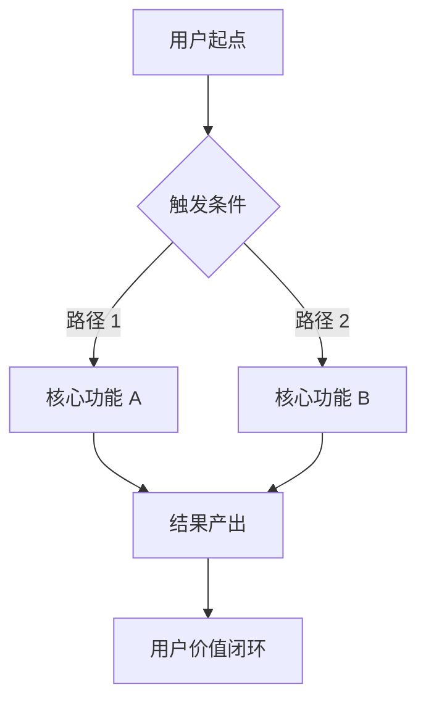
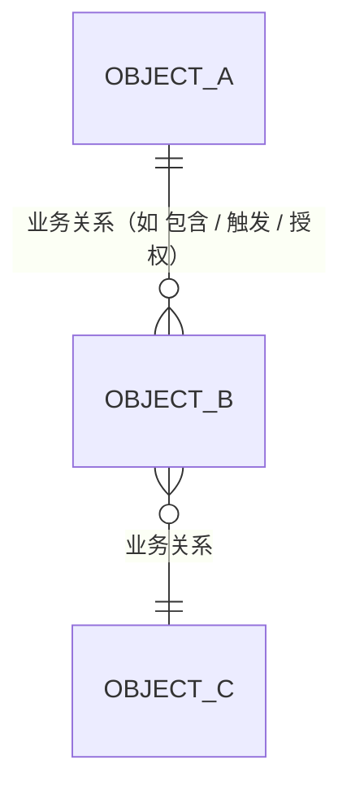
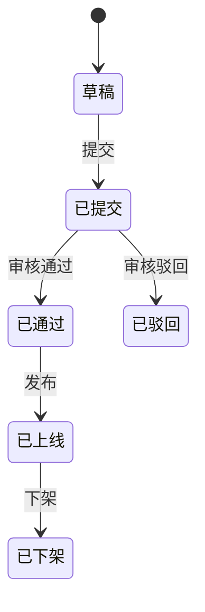

# {产品名} V{X.Y} 需求

## 一、版本说明

> 用 3-5 条要点说明本版本的核心变化，运营/开发/QA 看完这一段就能 get 重点。

1. {核心变化 1}
2. {核心变化 2}
3. {核心变化 3}

---

## 二、文档记录

### 修订记录

| 修订日期 | 版本 | 修订人 | 变更内容 |
|---|---|---|---|
| {YYYY-M-D} | v1.0 | {作者} | 初版 |

### 评审记录

| 评审时间 | 评审记录 |
|---|---|
| {YYYY-M-D} | {结论：通过 / 待修改；要点：xxx} |

### 参考文档

- **原型文件**：{链接}
- **设计稿**：{Figma 链接}
- **上一版 PRD**：{链接}
- **相关技术文档**：{链接}

---

## 三、业务背景与目标

### 3.1 业务背景

> 1-2 段描述：为什么要做这件事？现状是什么？业务上发生了什么？

### 3.2 用户痛点

| # | 痛点描述 | 当前频率/影响范围 | 数据支撑 |
|---|---|---|---|
| 1 | {例：{主要用户角色}在 {核心场景} 下遇到 {具体问题}} | {例：日均 {N} 次 / 影响 {X}% 用户} | {例：用户访谈 N=12 / 数据看板 url} |
| 2 | | | |

### 3.3 业务目标（北极星指标 + KR）

**北极星指标**：{你的核心增长/价值指标，必须可量化 + 单一指标}

**关键结果（OKR / KR）**（每个 KR 必须有量化值 + 基线来源）：
- KR1：{核心 metric A} 从 {当前值}（基线：{来源}）提升到 {目标值}
- KR2：{核心 metric B} 从 {当前值}（基线：{来源}）达到 {目标值}
- KR3：{核心 metric C} 从 {当前值}（基线：{来源}）降到 {目标值}

### 3.4 非目标（本期不做）

> 明确写出"什么不做"，防止 scope creep。

- ❌ {例：不做 {X 场景} —— 留待 V{X.Y+N}}
- ❌ {例：不做 {Y 能力} —— 由 {外部依赖} 提供}
- ❌ {例：不做 {Z 优化} —— ROI 不足}

### 3.5 端到端流程图（必填 · 串起用户旅程）

---

## 四、用户故事与场景

### 4.1 用户角色

| 角色 | 描述 | 主要诉求 |
|---|---|---|
| {主要用户 A} | {一句话身份描述} | {主要诉求 1-2 条} |
| {主要用户 B} | {...} | {...} |
| {终端用户/客户} | {...} | {...} |

### 4.2 典型场景

**场景 1：{标题}**
> {用一段叙事描述：什么人，在什么情况下，干什么，期望什么结果}

**场景 2：{标题}**
> {...}

### 4.3 用户故事

格式：作为 {角色}，我希望 {能力}，以便 {价值}。

- As {角色 A}，I want {核心动作 1}，so that {期望结果 1}。
- As {角色 B}，I want {核心动作 2}，so that {期望结果 2}。
- As {终端用户}，I want {核心动作 3}，so that {期望结果 3}。

---

## 五、需求范围

> 简表列出本版本的全部需求，**按优先级排序**。详细设计见「六、需求设计」。

| 序号 | 系统 | 功能 | 需求类型 | 优先级 | 需求内容 |
|---|---|---|---|---|---|
| 1 | {端 A} | {业务模块 A 名称}-{子功能 1} | 新增 | P0 | {一句话需求摘要} |
| 2 | {端 A} | {业务模块 A 名称}-{子功能 2} | 新增 | P0 | {一句话需求摘要} |
| 3 | {端 B} | {业务模块 B 名称}-{子功能 1} | 修改 | P1 | {一句话需求摘要} |
| 4 | {端 B} | {业务模块 B 名称}-{子功能 2} | 修改 | P2 | {一句话需求摘要} |

> **需求类型**：新增 / 修改 / 废弃
> **优先级**：P0=必须本期上线 / P1=本期争取 / P2=可延后

---

## 六、需求设计

> 按需求范围的顺序逐一详细设计。每个子需求包含：业务对象关系 / 页面功能详细设计 / AI 模块特化（如涉及对外生成式 AI）。

### 6.1 业务对象关系（业务视角 · 不写技术字段）

#### 6.1.1 业务对象总览

| 业务对象 | 业务定义 | 谁拥有 | 谁维护 |
|---|---|---|---|
| {对象 A} | {业务上是什么} | {角色} | {角色} |
| {对象 B} | {...} | | |

#### 6.1.2 关系图（mermaid · 业务概念命名 · 不写 PK/FK/类型）

#### 6.1.3 业务对象生命周期（每个有状态机的对象画一张）

#### 6.1.4 业务规则清单

> 跨对象的关键业务约束。

| # | 业务规则 | 涉及对象 |
|---|---|---|
| 1 | {例：评测对象是 {对象 A} 不是 {对象 B}} | {对象 A / B} |
| 2 | {例：{角色 X} 无 {动作 Y} 权限} | {角色 X} |

#### 6.1.5 对象-页面映射

| 业务对象 | 展示页面 | 操作页面 |
|---|---|---|
| {对象 A} | {页面 1 / 2} | {页面 3} |

### 6.2 页面功能详细设计

> 每个核心页面用 7 段标准模板填一段（详见 `page-design-template.md`）。

#### 页面 1：{页面名称}

| 维度 | 说明 |
|---|---|
| 业务场景 | {这页解决什么业务问题 · 谁主要用} |
| 页面布局 | {sidebar / topbar / 主区结构 / KPI / filter / 表格 / drawer / modal} |
| 关键字段 | {数据字段清单 ⊆ 6.1 业务对象 · 不要造新字段} |
| 交互动作 | {所有 click / hover / 提交触发的反馈 + 跳转 + toast / modal / drawer} |
| 状态变化 | {涉及状态机的页面要列状态迁移} |
| 异常处理 | {校验 / 失败 / 二次确认 / 权限不足 等边界场景} |
| 验收点 | ① {可勾选条件 1} ② {可勾选条件 2} ③ {可勾选条件 3} |

#### 页面 2：{页面名称}
{...同上...}

### 6.3 ⚙ AI 模块特化设计（**仅对外生成式 AI 必填**）

> 区分 AI 类型：
> - **对外生成式 AI**（用户直接看到生成内容）→ 详化本节
> - **内部 AI 依赖**（不对用户暴露，如评测引擎 LLM-judge）→ 在 §12 简述即可
> - **传统规则 / 检索 / 算法**（无 LLM）→ 不触发本节

#### 6.3.1 模型选择

- **主模型**：{model_name}，超时 {ms}
- **Fallback 链**：{model_name 1} → {model_name 2} → 预置话术兜底
- **决策依据**：{见 §13.4 ADR}

#### 6.3.2 提示词版本管理

- 提示词标识：{skill_id}@{version}
- 管理位置：{运营在 "技能管理" 页面切版本 + 一键回滚到上一稳定版}

#### 6.3.3 知识库依赖

- 检索 KB：{KB 名 1} / {KB 名 2}
- 召回策略：top-{N}，rerank 策略：{规则}
- 冷启动：上线前预录 {N} 条种子

#### 6.3.4 工具调用清单

- 白名单工具：`{tool_1}` / `{tool_2}`
- 入参 schema：{见接口文档}

#### 6.3.5 兜底策略

| 触发条件 | 兜底动作 | 文案 |
|---|---|---|
| 置信度 < {阈值} | 转人工 / 返回预置 | "{文案}" |
| LLM 超时 / 5xx | Fallback 模型 / 预置 | "{文案}" |
| 工具调用失败 | 重试 N 次后兜底 | "{文案}" |
| 安全检测拦截 | 拒绝回答 + 申报 | "{文案}" |

#### 6.3.6 可观测性（埋点必带字段）

- `trace_id` / `model` / `prompt_version` / `latency_ms` / `token_in` / `token_out` / `confidence` / `kb_hits` / `fallback_reason`

---

## 七、数据埋点

> 三段结构：**埋点说明 → 埋点看板 → 埋点上报设置**。事件清单可直接给数据 BI 同学建表。

### 7.1 埋点说明

- **目的**：{为什么要埋这些点？}
- **价值**：
  - 监控功能使用率（DAU / UV / 触发次数）
  - 度量 AI 效果（{核心 metric A} / {核心 metric B} / 兜底率）
  - 排查异常（错误率 / 超时率 / fallback 命中率）
  - {本期特有的验证目标}

### 7.2 埋点看板

#### 7.2.1 行为看板

> 监控用户的关键行为路径与转化。

| 看板名 | 维度 | 关键指标 | 数据来源（事件） |
|---|---|---|---|
| 核心转化漏斗 | 日 / {分组维度} | {步骤 1 → 2 → 3} | `{event_a}` / `{event_b}` |
| AI 采纳漏斗 | 日 / 用户 | 展示 → 采纳 / 编辑 / 拒纳 | `ai_response_show` / `_send` / `_edit_send` / `_reject` |
| 配置变更频次 | 日 / 操作者 | {配置项} 修改次数 | `{config_save_event}` |

#### 7.2.2 数据看板

| 看板名 | 维度 | 关键指标 | 告警阈值 |
|---|---|---|---|
| 业务效果 | 日 / 项目 | {核心 metric A / B / C} | {核心 metric A} < {阈值} 触发 |
| 时延分布 | 实时 | P50 / P90 / P99 | P99 > {阈值} 告警 |
| 兜底分布 | 日 | 按 reason 分桶（timeout / low_conf / no_kb / safety） | 总兜底率 > {阈值} 告警 |
| 成本 | 日 / 项目 | token 总用量 / 估算成本 | 超日预算 1.5x 告警 |

### 7.3 埋点上报设置（事件清单 · 9 列结构）

| 事件名称 | 事件描述 | 上报时机 | 事件 ID | 扩展字段 | 页面路径 | 页面名称 | 告警阈值 | 备注 |
|---|---|---|---|---|---|---|---|---|
| {核心动作 A} | {描述} | {时机} | `{event_a}` | {字段清单} | {路径} | {页面} | {阈值} | |
| AI 响应展示 | AI 输出生成完成 UI 渲染 | 模型输出完成 | `ai_response_show` | trace_id / model / skill_id / latency_ms / token_in / token_out / confidence / kb_hits | {主要交互页} | {页面名} | P99 > {阈值} 告警 / 错误率 > {阈值} 告警 | |
| AI 响应采纳 | 用户直接采纳 AI 输出（未修改） | 点击「确认/发送」（无编辑） | `ai_response_adopt` | trace_id / no_edit=true | {页面} | {页面名} | 采纳率 < {阈值} 周告警 | |
| AI 响应修改后采纳 | 用户编辑后再采纳（部分采纳） | 点击「确认/发送」（有编辑） | `ai_response_edit_adopt` | trace_id / edit_distance | {页面} | {页面名} | 重写率 > {阈值} 周告警 | |
| AI 响应拒纳 | 用户不采纳 AI 输出 | 关闭 + 重写 | `ai_response_reject` | trace_id / reject_reason | {页面} | {页面名} | 拒纳率 > {阈值} 周告警 | 自动入 BadCase 池 |
| AI 兜底触发 | LLM 失败 / 低置信 / 安全拦截 | 兜底分支命中 | `ai_fallback_trigger` | trace_id / reason (timeout/low_conf/no_kb/safety/tool_error) | 服务端 | — | 兜底率 > {阈值} 告警 | 必采样存储 |
| LLM 调用成本 | 每次 LLM 调用 token 与估算成本 | LLM 调用完成 | `llm_call_cost` | trace_id / model / token_in / token_out / cost_estimate | 服务端 | — | 日 token > 预算 1.5x 即时告警 | 成本预算配套 |

> **公共字段**（每事件必带）：`event_id` / `timestamp` / `user_id` / `user_role` / `project_id` / `session_id` / `client` / `env`。详见 `references/tracking-events-spec.md`。

---

## 八、评测指标与方法

> AI 产品必备。无 AI 功能则全章节填 N/A。

### 8.1 离线评测（上线前必跑）

#### 8.1.1 评测集

| 名称 | 类型 | 来源 | 样本数 | 备注 |
|---|---|---|---|---|
| Golden 黄金集 | 核心场景 | 人工标注 + 历史 PASS 案例 | {N} | 准入门槛 |
| BadCase 集 | 边缘场景 | 线上拒纳 / 用户反馈 / 客诉 | {N} | 退化检测 |
| 对抗集 | 安全 | 红队 prompt + 越狱样例 | {N} | 合规门槛 |

#### 8.1.2 评测维度与门槛

| 维度 | 指标 | 评测方法 | 通过门槛 |
|---|---|---|---|
| 准确性 | Golden 通过率 | LLM-as-judge | ≥ 85% |
| 相关性 | 回复与问题相关性 | LLM 评分 1-5 | ≥ 4.0 |
| 召回 | KB 命中率 | 关键词命中 | ≥ 70% |
| 安全 | 越狱抵抗率 | 对抗集通过率 | 100% |
| 时延 | P99 延迟 | 实测 | ≤ {阈值} |

#### 8.1.3 评测流程

1. 准备评测集 → 审核入库
2. 自动跑分（每轮版本变更触发）
3. 失败 case 人工抽检 10% 校准
4. 出报告 → 比对上一版本：**新版本必须 ≥ 旧版本（除非有合理理由）**

### 8.2 在线指标（上线后监控）

#### 8.2.1 业务指标

| 指标 | 当前值 | 目标值 | 监控周期 |
|---|---|---|---|
| {核心 metric A} | {当前} | ≥ {目标} | 日 |
| {核心 metric B} | {当前} | ≥ {目标} | 周 |
| {负向 metric}（如客诉率） | {当前} | ≤ {目标} | 日 |

#### 8.2.2 体验指标

| 指标 | 公式 | 目标 |
|---|---|---|
| 采纳率 | adopt / show | ≥ {阈值} |
| 重写率 | edit_adopt / show | ≤ {阈值} |
| 拒纳率 | reject / show | ≤ {阈值} |

#### 8.2.3 安全 / 异常指标

| 指标 | 目标 | 告警阈值 |
|---|---|---|
| 兜底触发率 | ≤ {阈值} | > {阈值 2} 告警 |
| LLM 超时率 | ≤ {阈值} | > {阈值 2} 告警 |
| 错误率 | ≤ {阈值} | > {阈值 2} 告警 |

---

## 九、非功能性需求

### 9.1 性能

| 指标 | 目标 |
|---|---|
| AI 响应时延 | P99 ≤ {阈值} |
| 知识库检索延迟 | P99 ≤ {阈值} |
| 并发能力 | {QPS} |
| 页面加载 | P99 ≤ {阈值} |

### 9.2 可用性

- SLA：{99.9%}
- 故障降级：LLM 失败时返回预置兜底，不中断业务
- 数据备份：{知识库 / 配置 / 日志} 各自的备份策略

### 9.3 兼容性

| 维度 | 范围 |
|---|---|
| 浏览器 | Chrome ≥ 100 / Edge ≥ 100 / Safari ≥ 15 |
| 移动端 | {如有移动端：iOS ≥ X / Android ≥ X} |
| 屏幕分辨率 | ≥ 1366x768 |

### 9.4 数据安全与隐私

- 用户输入 PII 自动脱敏（手机/身份证/银行卡）
- 操作审计：{核心配置变更} 全留痕
- 数据权限：按项目隔离
- 数据保留期：{对话数据 / 日志 / embedding 各自的保留时长}

### 9.5 AI 安全合规（涉及生成式 AI 必填）

> 国内法规：生成式 AI 服务管理暂行办法 / 算法推荐管理规定 / 网信办深度合成备案。

- **生成式 AI 备案号**：{备案号或办理时间表，未办理需在 §10 Checklist 作为阻塞项}
- **算法备案号**：{备案号或办理时间表}
- **内容过滤策略**：
  - 输入端：违禁词 / 政治敏感 / 涉黄涉暴 拦截
  - 输出端：模型输出后二次过滤；高确定性内容（如价格 / 库存）必须来自工具调用，不允许 LLM 生成
- **红队审查**：上线前完成对抗集测试（详见 §8.1 对抗集 100% 通过）
- **责任主体**：用户协议中明确 AI 生成内容的责任归属
- **下线机制**：高风险话题（如医疗诊断 / 投资建议）强制转人工，禁止 AI 回答

---

## 十、上线策略

### 10.1 灰度计划

| 阶段 | 时间 | 范围 | 准出标准 |
|---|---|---|---|
| 内测 | {日期} | 内部 5 个 {灰度单位} | 跑通核心流程，无 P0 bug |
| 小灰度 | {日期} | 10% {灰度单位} | {核心 metric A} ≥ {阈值}，无客诉 |
| 大灰度 | {日期} | 50% {灰度单位} | 业务指标符合预期 |
| 全量 | {日期} | 100% | — |

### 10.2 回滚预案

- **触发条件**：客诉率 > {阈值} / 错误率 > {阈值} / 业务方人工触发
- **回滚动作**：将 {提示词/技能/服务} 版本切回上一稳定版本（在 {管理页} 一键激活）
- **回滚时长**：≤ {N} 分钟

### 10.3 上线 Checklist

- [ ] 灰度开关配置就绪
- [ ] 监控告警配置（兜底率 / 错误率 / 时延 / **日 token 预算**）
- [ ] 用户培训材料 / 操作手册下发
- [ ] 离线评测全部通过（所有维度达门槛）
- [ ] 回滚演练完成
- [ ] FAQ 文档 + 用户引导素材
- [ ] 数据 BI 看板就绪
- [ ] **生成式 AI / 算法备案完成（涉及 AI 必填）**
- [ ] **内容安全过滤策略上线**

### 10.4 成本预算（涉及 LLM 必填）

> AI 产品最大的隐性成本来源。上线前必须算清，否则 token 费用失控。

#### 单次调用成本

| 模型 | 输入 token 单价 | 输出 token 单价 | 单次预估 token | 单次预估成本 |
|---|---|---|---|---|
| {主用模型} | {单价} | {单价} | {输入 + 输出} | {¥X} |
| {fallback 模型} | {单价} | {单价} | 同上 | {¥X} |

#### 月度预算估算

- 日活用户数：{N}
- 人均日调用次数：{N}
- 日均总调用：{N × N = X 次}
- **日均成本：{X × 单次成本 = ¥Y}**
- **月度预算：{¥Y × 30 = ¥Z}**

#### 成本控制

- 日预算上限：{¥X / 日}，超 1.5x 自动告警
- 月预算上限：{¥X / 月}，超 80% 业务知会
- 降级策略：超预算时自动切到 fallback / 拒绝低价值请求 / 关闭非核心 AI 功能

---

## 十一、验收清单

### 11.1 功能验收（QA）

| # | 功能点 | 验收用例 | 负责人 |
|---|---|---|---|
| 1 | {功能 1} | {合法 / 非法输入，校验提示正确} | QA |
| 2 | {功能 2} | {状态切换符合状态机定义} | QA |

### 11.2 数据验收（数据 BI）

- [ ] 全部 {N} 个事件按埋点表上报正确
- [ ] 公共字段无缺失
- [ ] 看板数据与日志一致（抽 100 条核对）

### 11.3 评测验收（算法 / QA）

- [ ] Golden 集通过率 ≥ 85%
- [ ] BadCase 集相对上一版本不退化
- [ ] 对抗集 100% 通过

### 11.4 性能验收（SRE）

- [ ] P99 延迟达标
- [ ] 压测通过 {QPS}
- [ ] 故障演练：LLM 宕机时兜底正常

---

## 十二、依赖与风险

### 12.1 上下游依赖

| 依赖方 | 内容 | 交付时间 | 负责人 |
|---|---|---|---|
| 模型平台 | 提供 {model_name} 接口 | {日期} | {人} |
| KB 团队 | 提供检索接口 | {日期} | {人} |
| 数据 BI | 看板搭建 | {日期} | {人} |
| 设计 | 视觉稿 | {日期} | {人} |

### 12.2 已知风险

| # | 风险描述 | 影响 | 应对 |
|---|---|---|---|
| 1 | 模型平台限流 | AI 调用失败 | Fallback 模型 + 本地缓存 |
| 2 | KB 数据冷启动 | 召回率低 | 上线前预录 {N} 条种子 |
| 3 | 用户不信任 AI | 采纳率低 | 显眼的"依据"展示 + 培训 |

### 12.3 排期与里程碑

| 阶段 | 起止日期 | 关键产出 |
|---|---|---|
| 需求评审 | | PRD 定稿 |
| 设计 | | 视觉稿 / 交互稿 |
| 开发 | | 联调可用 |
| 测试 | | 全部用例通过 |
| 灰度 | | 小灰度数据达标 |
| 上线 | | 全量发布 |

---

## 十三、附录

### 13.1 术语表

| 术语 | 解释 |
|---|---|
| KB | Knowledge Base，知识库 |
| Golden 集 | 核心场景的标注数据，AI 准入门槛 |
| BadCase 集 | 线上失败案例，用于退化检测 |
| 对抗集 | 红队 prompt + 越狱样例，安全门槛 |
| 采纳率 | 用户直接采纳 AI 输出（未修改）的比例 |
| 重写率 | 用户编辑 AI 输出后再采纳的比例 |
| 拒纳率 | 用户完全不采纳 AI 输出的比例 |
| 兜底 | LLM 异常或低置信度时返回预置回复 |
| {本期新术语} | {解释} |

### 13.2 链接

- 原型：{Figma / 设计平台链接}
- 数据看板：{BI 链接}
- 上线后线上地址：{URL}
- 评测报告：{链接}
- 接口文档：{Swagger / Apifox 链接}

### 13.3 历史版本

- V{X.Y-2}：{差异 + 上线日期}
- V{X.Y-1}：{差异 + 上线日期}
- V{X.Y}（本期）：{差异}

### 13.4 关键决策记录（ADR）

> 记录本期重要的"为什么选 A 不选 B"。3 个月后接手的人不用扯皮。

| 序号 | 决策 | 可选方案 | 选择 | 理由 | 决策人 | 日期 |
|---|---|---|---|---|---|---|
| 1 | {模型选择} | {model_A} / {model_B} / {model_C} | {选定模型}（主），{model_B}（fallback） | {中文能力 + 调用稳定性 + 成本三角衡量} | {人} | {日期} |
| 2 | {检索策略} | BM25 / 纯向量 / 混合 | 混合（BM25 + 向量 + rerank） | {召回率最高，权衡精度} | {人} | {日期} |
| 3 | {兜底阈值} | 0.5 / 0.6 / 0.7 | 0.6 | {历史评测：拐点位置} | {人} | {日期} |

**新增决策格式**：每次评审会后，把"差点没拍板的争议"补一行进来。
